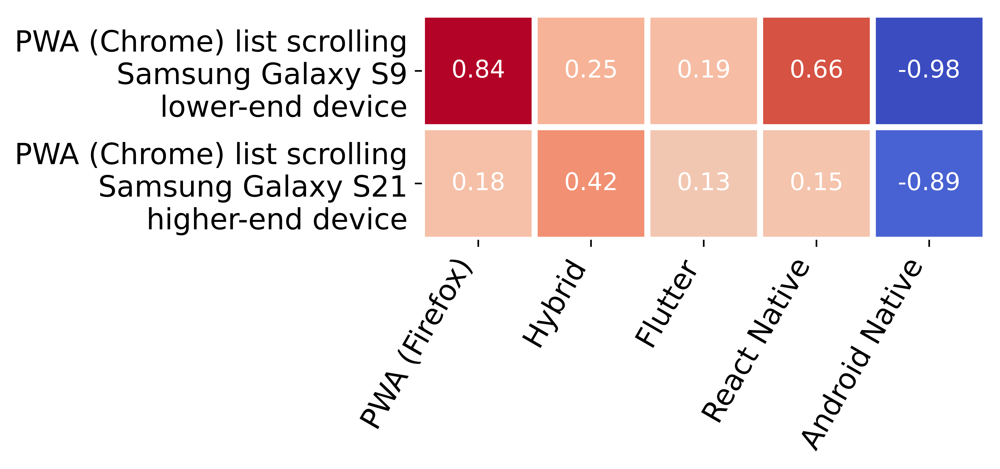

# A Comparative Study on the Energy Consumption of Progressive Web Apps

## Project setup

 - The project is using Python 3
 - Inside the project folder `python -m venv venv` or `virtualenv venv` creates a virtual environment
 - `./venv/Scripts/activate` activates the virtual environment (Windows 10)
 - Install all project dependencies with `pip install -r requirements.txt` within an active virtual environment, the project dependencies are mainly required for the analysis and result preparation
 - For running the battery tests real Android devices are required, which enable the [on-device developer options](https://developer.android.com/studio/debug/dev-options)
 - For connecting and controlling the Android devices the [Android Debug Bridge (adb)](https://developer.android.com/studio/command-line/adb) must be installed on the controlling computer

## Repository content

 - **sample app implementations**: Source code of the apps under test and instrumentation
    - instrumentation: UI Automator Android app 
    - contactapp-native: Android native implementation of app
    - contactapp-react-native: React native implementation of app
    - contactapp-stencil: Stencil/Ionic/Capacitor implementation of app
    - contactapp-flutter: Flutter implementation of app
    - contactapp-webviewwrapper: PWA wrapped inside the default Android WebView
    - contactapp-geckowrapper: PWA wrapped inside the Gecko WebView
 - **data**: raw data measured with the `batterystats` service, the `sample_apps` subfolder contains the sample app measurements and the `real_world_apps` supfolder contains the real-world app measurements
 - **figures**: generated figures for paper
 - **helper**: python helper functions, e.g. for using `adb` or `batterystats`
 - **Analysis.ipynb**: Notebook with statistical analysis and generation of figures
 - **connect.py**: Script to try to establish Wi-Fi connection with USB-connected device  
 - **prepare.py**: Setup script for preparing a connected device 
 - **start_battery_test.py**: Script to start the complete battery test for sample apps on a connected device
 - **start_single_battery_test.py**: Script to start a single app battery test for a sample app on a connected device
 - **start_scroll_battery_test.py**: Script to start a single app battery test for a real-world app on a connected device

## Setup for battery tests

### Connect device via Wi-Fi

 - connect mobile device via USB cable to computer
 - get IP-address form mobile device: `adb shell ip address` and search for `wlan0` 
 - enable port 5555 for tcp/ip connection mode `adb tcpip 5555` on mobile device
 - connect to mobile device via Wi-Fi: `adb connect "IP-ADDRESS":5555` (adb connect 192.168.2.100:5555)
 - unplug USB cable from mobile device

> The `connect.py` script automatizes this procedure
 
### Prepare device for testing sample apps

#### Sample apps

The sample apps and instrumentation project are compiled, signed and put into the `apk` folder.  To install all apps inside the `apk` folder run the `prepare.py` script. This requires an adb connected device. The `.apk` files can be downloaded compiled and signed from the [GitHub releases](https://github.com/stefanhuber/pwa-energy-comparison/releases/tag/1.0.0).

```bash
> python prepare.py
```

In order to test the apps, test entries must be created inside the sample apps.

#### Sample PWA

The PWA is deployed [here](https://contactapp.stefanhuber.at) and must be installed with Chrome and Firefox on the respective device.

### Run battery test for sample apps

This requires that the device is connected via Wi-Fi and the `IP-ADDRESS` is known. See `Connect adb via Wi-Fi` above for connecting to device. To start the battery test for the sample apps the following command can be used (`IP-ADDRESS` must be substituted with the respective ip address of the device, `-n` states the number of test runs, which should be executed).

```bash
> python start_battery_test.py -i IP-ADDRESS -n 30
```

### Prepare device for testing real-world apps

#### Real-world apps

The following real-world apps must be installed on the respective test device:

| App | Development |
| --- | --- |
| [NewPipe](https://newpipe.net/) | Android Native |
| [F-Droid](https://f-droid.org) | Android Native |
| [Tiny Weather Forcast](https://codeberg.org/Starfish/TinyWeatherForecastGermany) | Android Native |
| [Ulangi](https://ulangi.com/) | React Native |
| [Bus Timetable](https://github.com/EarlGeorge/timetable) | React Native |
| [YumMeals](https://github.com/BernStrom/YumMeals) | React Native |
| [Flutter Ebook App](https://github.com/JideGuru/FlutterEbookApp) | Flutter |
| [Metal Releases](https://play.google.com/store/apps/details?id=org.onepointzero.metalreleases) | Flutter |
| [No Mans sky Recipes](https://play.google.com/store/apps/details?id=com.kurtlourens.no_mans_sky_recipes) | Flutter |
| [Aliexpress](https://m.de.aliexpress.com/) | PWA |
| [Versus](https://versus.com/) | PWA |
| [Swiggy](https://www.swiggy.com/) | PWA |
| [Sworkit](https://play.google.com/store/apps/details?id=sworkitapp.sworkit.com) | Capacitor |
| [JustWatch](https://play.google.com/store/apps/details?id=com.justwatch.justwatch) | Capacitor |
| [Untappd](https://play.google.com/store/apps/details?id=com.untappdllc.app) | Apache Cordova |

#### App screens

For each app the respective app screen must be opened, before the test run is started:

 - Untappd: `Top rated beers` without filters
 - MetalReleases: `Upcoming`
 - JustWatch: `Popular`
 - Assistant for No Man's Sky: All Recipies
 - Flutter Ebook App: `Explore` > `Short Stories`
 - Swiggy: `View all Restaurants`
 - Swörkit: `Exercise Library`
 - letgo: `Electronics`
 - Ulangi: Spanish - English, Animals
 - Bus Timetable: `Lines`
 - AliExpress: Search something
 - YumMeals: Open in Expo Go, Search San Francisco
 - F-Droid: `Category` `Internet`
 - NewPipe: Trending
 - Tiny Weather Forcast: Just open

#### Real-world app sources

The following sources were used to collect the real-world apps:

 - [Android Native](https://f-droid.org/en/packages/)
 - [React Native Apps](https://github.com/ReactNativeNews/React-Native-Apps)
 - [PWAs](https://github.com/hemanth/awesome-pwa)
 - [Flutter Apps](https://github.com/Solido/awesome-flutter)
 - [Capacitor/Cordova](https://ionic.io/resources/case-studies)

For decompiling an app, the `.apk` file was downloaded from [APKMirror](https://www.apkmirror.com/) or a similar website and decompiled with the [Apktool](https://ibotpeaches.github.io/Apktool/).

### Run battery test for real-world apps

This requires that the device is connected via Wi-Fi and the `IP-ADDRESS` is known. See `Connect adb via Wi-Fi` above for connecting to device. To start the battery test for the sample apps the following command can be used (`IP-ADDRESS` must be substituted with the respective ip address of the device, `-n` states the number of test runs, which should be executed, `-a` states the name of the app for latter identification throughout the analysis).

```bash
> python start_scroll_battery_test.py -i IP-ADDRESS -n 30 -a aliexpress
```

## Result analysis

All analysis steps and the result preparation of the energy measurements can be found inside the accompanying `Analysis.ipynb` Jupyter notebook.

Inside an active virtual environment the notebook can be run with `jupyter notebook`. Inside Jupyter overview open the `Analysis.ipynb` notebook.

### Sample app results

#### Energy consumption of different UI interaction scenarios


#### Heatmap of the calculated Cliff’s delta effect sizes


### Real-world app results

#### Energy consumption of different UI interaction scenarios


#### Heatmap of the calculated Cliff’s delta effect sizes

